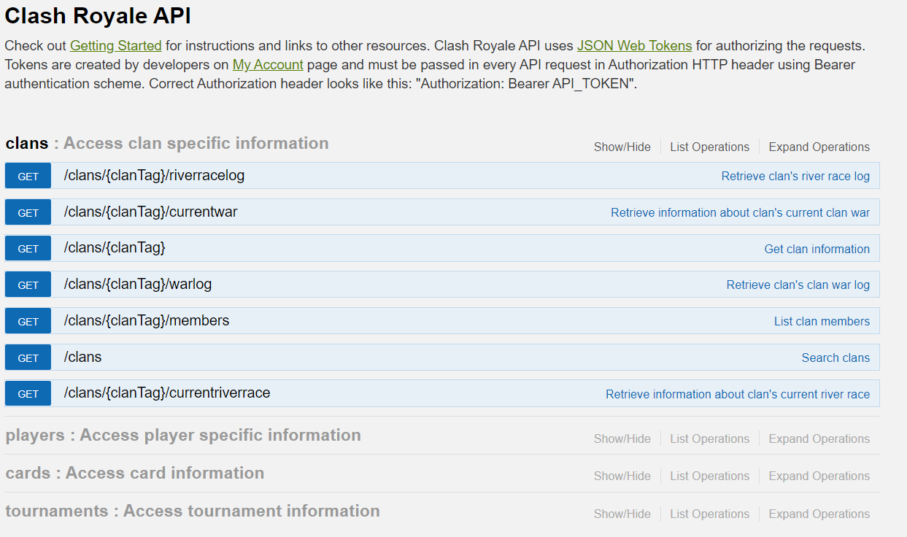

# CR Proxy API

A simple proxy to use RoyalAPI API, in simple terms you can send `get` requests to this URL as you would use to the endpoints indicated on the Clash Royale API documentation, but without any authentication token and directly from the frontend. Check the docs [here](https://developer.clashroyale.com/#/documentation)!

